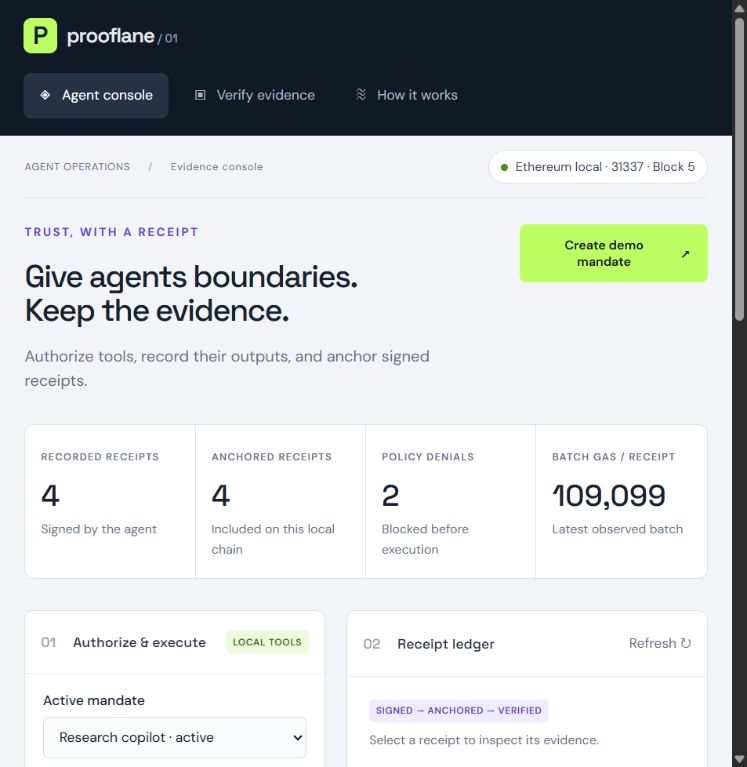
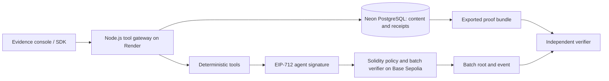
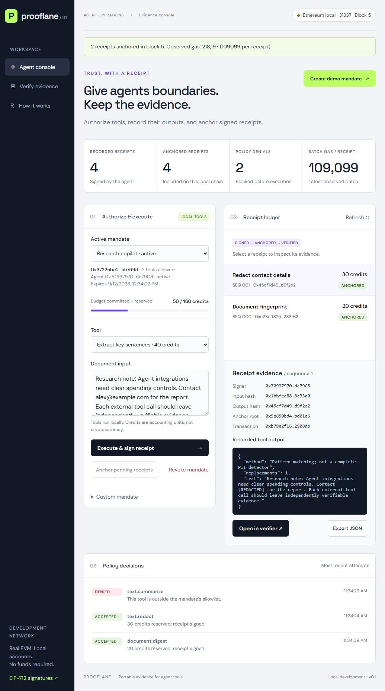
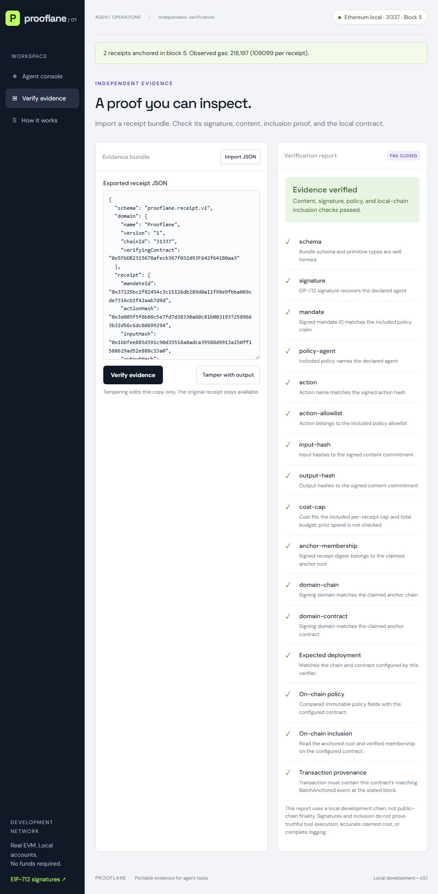
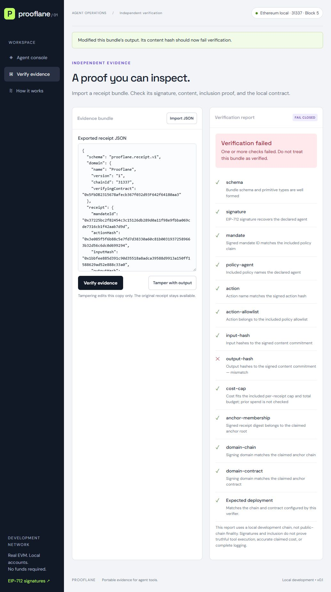

<div align="center">

# 🧾 Prooflane ⛓️

### Policy-Controlled Agent Tools · Signed Execution Receipts · Independent Verification

<p align="center">
  
  
  
  
  
  
  
  
  <a href="https://github.com/mitraboga/Prooflane/actions/workflows/ci.yml"></a>
  <a href="LICENSE"></a>
</p>



**Authorize → Execute → Sign → Anchor → Verify**

[Public Hosting](docs/public-deployment.md) · [Local Quick Start](#-run-it-end-to-end) · [Architecture](#architecture) · [Solidity](#-solidity-in-practice) · [Measurements](#-testing-and-measurements) · [Interview Guide](docs/interview-guide.md)

</div>

---

## 📖 Project Overview

An agent can call tools on someone's behalf, but an ordinary application log leaves important questions with its operator: **Which key signed this result? Was the action within the owner's policy? Has the recorded output changed?**

**Prooflane** is an end-to-end evidence system for that workflow. An owner publishes an agent's permissions and credit limits in a Solidity contract. A Node.js gateway executes permitted tools and signs receipts. The contract validates batches of receipts, and another party can verify an exported JSON bundle against the expected deployment.

> **Current status:** public hosting support is implemented for **Render + Neon PostgreSQL + Base Sepolia**, with visitor isolation, persistent transaction recovery and free-demo limits. Account configuration and the funded testnet deployment are still pending; no live URL is claimed yet. The original **SQLite + Anvil** mode remains runnable without credentials. This is a portfolio demo with deterministic tools, not an autonomous LLM or payment service.

### What This Project Demonstrates

- **Full-stack delivery:** a usable console backed by an HTTP API, persistent storage and a reproducible local environment.
- **Applied Web3:** EIP-712 signatures, EVM transactions, contract events, Merkle proofs and independently checked contract state.
- **Systems engineering:** pending budget reservations, idempotent requests, atomic settlement and database reconciliation after a mined transaction.
- **Evidence-driven design:** adversarial tests, reproducible gas measurements and explicit trust boundaries.

The intended use case is a tool gateway whose consumers need portable evidence of policy acceptance. The prototype uses deterministic text tools so the complete path can be demonstrated without an external service. Its contribution is the integration of policy, execution and verifiable evidence; [research and precedents](docs/research.md) explain the related work.

---

## 🧰 Technology Stack

| Layer | Implementation | Why it is used |
| --- | --- | --- |
| Interface | HTML, CSS, vanilla JavaScript | Responsive console and verifier with no frontend build step |
| API and orchestration | Node.js 24+, native HTTP, ES modules | Request validation, execution, signing and settlement in readable modules |
| Persistence | Neon PostgreSQL with `pg` 8.23.0; SQLite WAL for local development | Receipts, content, reservations, scoped request IDs, transaction intents and recovery cursors |
| Hosting | One Render Free Node web service | Serves the website and API together over HTTPS; no separate frontend server |
| Ethereum client | ethers 6.17.0 | Typed-data signing, ABI encoding, deployment, transactions and event reads |
| Contract | Solidity 0.8.28 | Deterministic policy enforcement and receipt acceptance |
| Public chain | Base Sepolia, chain ID `84532` | Existing Solidity deployment, testnet gas, canonical block confirmation checks and explorer links |
| Development chain | Native Foundry Anvil 1.7.1, chain ID `31337` | Credential-free local transactions with persistent history |
| Verification and quality | Node test runner, standalone CLI, GitHub Actions | Cross-language checks, failure tests and repeatable validation |

## Architecture



The diagram shows the public configuration. Local development uses the same flow with SQLite and Anvil. The database serves queries and stores full content. The chain enforces acceptance rules and publishes commitments. A single trusted organization may be better served by signed logs or a transparency log. The blockchain is useful when counterparties need independently observable policy acceptance; it is not a replacement for ordinary storage.

Read [architecture and trust model](docs/architecture.md), [protocol specification](docs/protocol.md), and [research and precedents](docs/research.md).

---

## 🔄 End-to-End Working Principle

### 1. Publish the owner's policy

**Create demo mandate** submits an owner transaction defining the agent address, allowed-tool Merkle root, **160-credit budget**, **75-credit per-receipt cap** and expiry. The demo permits fingerprinting and redaction. A custom mandate lets the user choose different limits.

The contract stores the policy. The gateway keeps its human-readable label and tool names in the database. Policy creation is an owner transaction; the copied policy inside an exported bundle is not itself an owner-signed EIP-712 document.

### 2. Validate, execute and sign

The client supplies a mandate, tool, input and request ID. Before execution, the gateway checks the current policy and includes pending reservations in the budget calculation:

```text
on-chain spent + database-reserved credits + next tool cost <= mandate budget
```

| Tool | Actual behavior | Cost |
| --- | --- | ---: |
| `document.digest` | SHA-256 fingerprint of the supplied text, with byte, character and word counts | 20 credits |
| `text.redact` | Replace common email and phone patterns; not a complete PII filter | 30 credits |
| `text.summarize` | Extract the first three sentences; no LLM inference | 40 credits |

A permitted tool runs on the gateway. The gateway hashes its input and output, assigns a consecutive nonce, signs the receipt with the agent key and saves it transactionally. Its status is **pending**, with credits reserved but no chain inclusion yet.

For the demo, fingerprinting and redaction reserve **50 credits**. Attempting sentence extraction produces an allowlist denial before the tool runs. Denials are off-chain operational records; only accepted executions receive signed receipts.

### 3. Anchor the pending receipts

**Anchor pending receipts** sends the receipt structs, signatures and tool proofs to Solidity. Every receipt must satisfy the mandate. One invalid receipt reverts the whole batch.

For the two-call example, successful settlement changes `spent` from `0` to `50` and `nextNonce` from `0` to `2`. The contract stores a batch commitment, links it to the previous root and emits `BatchAnchored`. The gateway indexes the transaction and marks the receipts **anchored**.

<p align="center">
  
</p>

*Actual local demo: the selected mandate has two anchored receipts and 50 committed credits. The top counters include earlier workspace runs.*

### 4. Export and independently verify

Selecting a receipt exposes its signer, content hashes, root, transaction and recorded output. **Export JSON** produces a portable bundle containing the receipt, signature, input/output, policy claim, action proof and batch inclusion proof. **Open in verifier** checks that evidence against the configured deployment. Public mode also links transactions to Base Sepolia’s explorer.

A signed receipt proves what the key claimed. Chain verification additionally proves that the configured contract accepted it under its rules. Neither establishes that an external tool told the truth.

---

## 🔗 Solidity in Practice

[`contracts/Prooflane.sol`](contracts/Prooflane.sol) is the acceptance authority. The JavaScript gateway provides early feedback, while Solidity repeats the security checks so a caller cannot bypass them by submitting a transaction directly.

### Contract Lifecycle and JavaScript Integration

1. `src/compile.mjs` compiles the Solidity source with **solc 0.8.28**, optimizer **200 runs**, **viaIR** and the **Shanghai** EVM target.
2. `scripts/deploy.mjs` deploys the public contract explicitly and records its address, transaction and creation block. `src/chain.mjs` connects to that existing contract, checks chain `84532`, and compares its runtime bytecode with the build artifact. Local mode still deploys on first startup.
3. `src/service.mjs` creates mandates, signs receipts using the actual chain ID, saves the signed transaction before broadcast, waits for the configured confirmations and reconciles events with PostgreSQL.
4. The verifier reads contract state and transaction logs through the ABI to authenticate exported evidence.

The compiled runtime is **3,736 bytes** for the recorded build. No proxy, token, custody, transfer logic or external contract calls are involved.

| Function | Practical responsibility |
| --- | --- |
| `createMandate(...)` | Store `msg.sender` as owner and register immutable agent, tool root, budget, cap and expiry |
| `revokeMandate(id)` | Allow only the owner to stop future execution/settlement under the mandate |
| `hashReceipt(receipt)` | Reproduce the EIP-712 digest in Solidity for agreement with the JavaScript signer |
| `settleBatch(...)` | Validate 1–32 receipts atomically, advance accounting, store the root and emit an event |
| `verifyReceipt(root, leaf, proof)` | Check membership in a registered batch; this is an inclusion check, not full bundle verification |

### What the Agent Actually Signs

The contract and JavaScript protocol share this exact type:

```solidity
struct Receipt {
    bytes32 mandateId;
    bytes32 actionHash;
    bytes32 inputHash;
    bytes32 outputHash;
    uint256 cost;
    uint256 nonce;
}
```

The gateway signs it with:

```js
const signature = await this.agent.signTypedData(
  this.domain,
  RECEIPT_TYPES,
  receipt
);
```

The **EIP-712 domain** contains `name: "Prooflane"`, `version: "1"`, the chain ID and verifying contract address. It binds the signature to a deployment. Solidity combines the domain separator and struct hash using the EIP-712 prefix, then recovers the agent with `ecrecover`.

Recovery rejects malformed signatures, invalid `v`, zero-address recovery and noncanonical high-`s` values. The contract supports ordinary EOA signatures; ERC-1271 contract-wallet signatures are not implemented.

### What Settlement Enforces

For every batch, Solidity checks:

- The mandate exists, is not revoked and has not expired at settlement time.
- Array lengths agree and the batch contains at most 32 receipts.
- Each receipt names this mandate and supplies the **exact next nonce**.
- Each claimed cost fits the per-receipt cap and the cumulative remaining budget.
- Each action has a valid proof under the mandate's allowlist root.
- Each recovered signer matches the mandate's agent.

Only after all checks pass does it update `spent`, `nextNonce`, `latestRoot` and the batch record. Any relayer may submit a valid batch; relaying does not authorize changing signed fields. Replaying an accepted receipt fails the nonce check.

Revocation also blocks settlement of pending receipts. Already anchored evidence remains valid historical evidence even after the mandate expires or is revoked.

---

## 🔐 Hashing, Merkle Proofs and Data Placement

| Mechanism | Implementation | Purpose |
| --- | --- | --- |
| Content commitment | SHA-256 over canonical JSON; recursively sorted object keys, preserved array order | Detect changes to inputs and outputs |
| Action identity | Keccak-256 of the case-sensitive tool name | Bind a readable tool name to a contract-verifiable identifier |
| Receipt leaf | Full EIP-712 digest, including the domain | Bind policy ID, action, content hashes, cost and nonce to the agent |
| Allowlist tree | Merkle tree of permitted action hashes | Prove a tool belongs to the owner's policy |
| Receipt tree | Merkle tree of accepted receipt digests | Prove one receipt belongs to an anchored batch |

Both application trees hash sorted pairs with Keccak-256 and promote an unpaired odd node unchanged. A singleton has an empty proof. A proof establishes **membership**; consecutive contract nonces enforce submission order. Previous-root links connect accepted batches but cannot prove that an agent reported every real-world action.

Costs and nonces cross JSON boundaries as decimal strings, avoiding JavaScript integer precision loss. Canonicalization rejects unsupported/lossy values; its exact rules are [versioned in the protocol](docs/protocol.md).

| Location | Data held there |
| --- | --- |
| PostgreSQL (SQLite locally) and exported bundles | Full input/output, signatures, receipts and application metadata |
| Contract storage | Mandates, accounting counters, batch metadata and previous-root links |
| Transaction calldata | Submitted receipt fields, content hashes, signatures and action proofs |
| Contract events | Creation/revocation records and batch anchor metadata |

Full documents are kept off chain, but **receipt fields and hashes are visible in transaction calldata**. Hashing is not encryption. Exporting a bundle discloses its included content; labels, request IDs and application timestamps are not signed receipt fields.

---

## 🔎 Verification and Tamper Detection

| Mode | Checks performed | Trust boundary |
| --- | --- | --- |
| Offline CLI | Schema, signature, content hashes, action proof, cap consistency, Merkle membership and domain consistency | Cannot establish that the supplied policy or root ever existed on a trusted chain |
| Online CLI / browser verifier | Offline checks plus expected chain/contract, immutable on-chain policy, batch inclusion and the precise successful transaction's anchor event/block | Depends on the independently configured deployment and RPC; public mode requires three canonical L2 blocks by default; this is not Ethereum settlement finality |

The verifier does not let an imported bundle choose its own trusted deployment. Otherwise an attacker could supply a different contract or invented root and a self-consistent story.

<details>
<summary><b>📸 Successful verification: content, signature, policy and local-chain inclusion</b></summary>

<p align="center">
  
</p>

</details>

**Tamper with output** changes a copy of the exported content. The output hash no longer matches the signed commitment, so the overall report fails. The signature can still pass because the signed receipt itself has not changed. Editing the signed hash to match the new content would invalidate that signature.

<details>
<summary><b>📸 Tampered copy: the output-hash check fails</b></summary>

<p align="center">
  
</p>

</details>

The stored original stays available. Verification fails closed rather than accepting a bundle because only some checks passed.

---

## 💾 Reliability and Failure Handling

| Problem | Implemented behavior |
| --- | --- |
| A client retries a request | The same request ID and payload return the existing receipt; a changed payload under that ID returns HTTP 409 |
| Concurrent calls consume the same remaining budget | A process queue and PostgreSQL advisory lock serialize reservations and signer nonces; transactions and unique constraints protect records |
| One receipt in a batch is invalid | Solidity reverts the whole transaction without partial accounting updates |
| Mining succeeds before the database is updated | A durable signed-transaction journal recovers the saved hash; bounded `BatchAnchored` indexing reconciles receipt state |
| The service restarts | Public records remain in Neon and contract state remains on Base Sepolia; local mode uses SQLite plus Anvil snapshots |

PostgreSQL transaction-level advisory locks coordinate mutations across overlapping service processes; each process also keeps a queue. All instances must use the same database and signer. Signed transaction bytes are committed before broadcast and replayed with the same hash after an uncertain response. The database and chain still do not share a distributed transaction.

The public index scans bounded block ranges from a persistent cursor and checks canonical confirmations when settling and verifying. Deep reorganization rollback and automatic replacement of stuck transactions remain operator work. The local mode retains Anvil checkpoints; a crash before a checkpoint can lose recent local chain changes. External tools would need their own idempotency or compensation rules.

---

## 🚀 Run It End-to-End

### 1. Install and Start Locally

Requires **Node.js 24+** and npm on Windows x64, Linux x64/ARM64 or macOS x64/ARM64. Keep optional npm dependencies enabled so the pinned native Anvil binary installs.

```sh
git clone https://github.com/mitraboga/Prooflane.git
cd Prooflane
npm ci
npm start
```

Open **[http://127.0.0.1:3000](http://127.0.0.1:3000)**. This is the locally running application, not a hosted demo. Startup compiles/deploys once and reuses saved state on subsequent runs. The web server and EVM bind to loopback; ports **3000** and **8545** must be free.

### 2. Demonstrate the Workflow

In the console:

1. Create a demo mandate.
2. Execute **Document fingerprint**, then **Redact contact details**.
3. Attempt **Extract key sentences** to demonstrate a policy denial.
4. Anchor the two pending receipts.
5. Open an anchored receipt in the verifier, then tamper with its output.
6. Return to the original receipt to verify it again.

Or run the complete SDK demonstration in a second terminal:

```sh
npm run demo
```

It creates its own **100-credit / 40-credit-cap** mandate, executes two allowed tools, checks a denial, anchors, verifies and rejects a modified copy. It writes `data/exports/demo-receipt.json`.

### 3. Verify Outside the Browser

Offline consistency:

```sh
npm run verify -- data/exports/demo-receipt.json
```

For chain-backed checks, replace `CONTRACT_ADDRESS` with the address printed by your trusted local startup:

```sh
npm run verify -- data/exports/demo-receipt.json --rpc http://127.0.0.1:8545 --chain-id 31337 --contract CONTRACT_ADDRESS
```

Exit code `0` means the requested checks passed; `1` means verification failed.

### Public Hosting

[Deployment runbook](docs/public-deployment.md) covers the exact Render settings, Neon connection, encrypted testnet-key helper, faucet funding, contract deployment and live acceptance checks. [`render.yaml`](render.yaml) explicitly selects the Free plan. Render serves the existing website and API in one process; GitHub Actions validates the code.

Public visitors receive a signed, HttpOnly session cookie and see only their own mandates and evidence. The server sponsors testnet gas; visitors need no wallet. Keep the cookie to revisit that workspace, and export important bundles. Clearing cookies or changing the session secret loses access to the guest workspace.

### Configuration and Operations

| Variable | Default | Purpose |
| --- | --- | --- |
| `PROOFLANE_MODE` | `local` | `local` or `base-sepolia`; public mode fails startup if required settings are missing |
| `PORT` | `3000` locally; provided by Render | Browser/API port |
| `CHAIN_PORT` | `8545` | Local EVM RPC port |
| `DATA_DIR` | `./data` | SQLite and persistent chain data |
| `PROOFLANE_URL` | `http://127.0.0.1:3000` | SDK example's gateway URL |

A `.env` file is not loaded automatically. Set shell environment variables or explicitly run `node --env-file=.env src/server.mjs` after creating the file. Use a new `DATA_DIR` for a separate clean demo; preserve existing data and keep the chain/database together. Stop with **Ctrl+C**.

If Anvil is missing, check your platform and reinstall with optional dependencies enabled. If a port is busy, choose another port through the variables above and update the browser/SDK URL accordingly.

---

## 🔌 SDK and HTTP API

The SDK is a small transport client. **The gateway signs receipts** using its configured demonstration agent; the SDK caller does not hold the signer.

Run the following from an ES module at the repository root while the server is running:

```js
import { ProoflaneClient } from './sdk/client.mjs';

const client = new ProoflaneClient(); // Or pass the verified public HTTPS URL.
const policy = await client.createMandate({
  label: 'Interview demo',
  budget: '100',
  maxPerReceipt: '40',
  ttlMinutes: 60,
  tools: ['document.digest', 'text.redact']
});

const requestId = crypto.randomUUID(); // Retain this ID when retrying this call.
const receipt = await client.execute(
  policy.id,
  'document.digest',
  { text: 'A document whose recorded result can be checked later.' },
  requestId
);

await client.anchor(policy.id);
const bundle = await client.exportReceipt(receipt.id);
const report = await client.verify(bundle);
console.log(report.valid);
```

| Endpoint | Responsibility |
| --- | --- |
| `GET /api/session` | Establish/reuse a visitor cookie; the SDK handles this automatically |
| `GET /api/health`, `GET /api/state` | Readiness and the current visitor’s policies, catalog and evidence |
| `POST /api/mandates` | Create an on-chain policy |
| `POST /api/execute` | Validate and execute one tool; return a pending signed receipt |
| `POST /api/anchor` | Settle pending receipts for a mandate |
| `POST /api/revoke` | Submit owner revocation |
| `GET /api/receipts/:id/bundle` | Export an anchored receipt |
| `POST /api/verify` | Verify a bundle against the configured deployment |

Mutations require JSON and `X-Prooflane-Client: prooflane-v1`. Public mode also requires a valid signed guest cookie and the configured host/origin. These sessions isolate demo visitors; they are not verified user identities. Local mode also accepts the legacy `local-demo` header. Input is bounded to 5,000 text characters, request bodies to 100 KB and pending receipts to 32 per mandate.

See the [API reference](docs/api.md) for schemas, status codes and limits, and [the complete SDK example](examples/agent.mjs) for rejection and tamper handling.

---

## 📊 Testing and Measurements

### Validation

```sh
npm run check
npm run compile
npm test
npm run benchmark
npm run lab:bitcoin
npm audit
```

The suite defines **57 tests**, including a PostgreSQL integration scenario that runs in CI; without `TEST_DATABASE_URL`, that scenario is skipped. See the [validation record](docs/validation.md) for observed runs.

| Suite | Tests | Main coverage |
| --- | ---: | --- |
| Operator wallet | 2 | Password-encrypted key recovery across processes, signature verification, wrong-password rejection and preservation of existing wallets/deployments |
| Solidity contract | 14 | Signature/domain agreement, authorization, nonces, caps, budgets, expiry, revocation and atomic batches |
| Protocol | 10 | Canonicalization, hashing, Merkle edge cases, schema rejection and altered bundles |
| HTTP/service integration | 13 | Complete workflow, concurrent reservations, visitor isolation, idempotency, restart recovery, lost broadcast responses and durable quotas |
| Public configuration and HTTP | 8 | Cookie forgery/expiry, host/origin enforcement, rate limits, TLS, unsafe keys, deployment identity and canonical confirmations |
| PostgreSQL integration | 1 | Two independent services, advisory locks, atomic rollback, evidence recovery and deployment mismatch rejection |
| Local EVM persistence | 2 | Chain snapshot and historical state restoration |
| Bitcoin lab | 7 | SHA-256d vectors, linked blocks, Merkle behavior, UTXO rules and double-spend rejection |

[GitHub Actions](https://github.com/mitraboga/Prooflane/actions/workflows/ci.yml) runs installation, syntax checks, compilation, tests and a high-severity dependency audit on Node 24 / Ubuntu with an ephemeral PostgreSQL 18 service. The badge at the top reports the current workflow status.

### Measured Batch Tradeoff

| Receipts per batch | Mean batch gas | Mean gas / receipt | Merkle proof bytes |
| ---: | ---: | ---: | ---: |
| 1 | 206,437.333 | 206,437.333 | 0 |
| 2 | 216,510 | 108,255 | 32 |
| 8 | 276,932.333 | 34,616.542 | 96 |
| 16 | 357,387 | 22,336.688 | 128 |
| 32 | 518,555 | 16,204.844 | 160 |

A **32-receipt batch reduced gas per receipt by 92.15%** versus a singleton in this synthetic workload. Batching amortizes shared transaction/storage overhead; each receipt still requires validation, total gas increases, and waiting to fill a batch can delay anchoring.

**Measurement scope:** recorded September 11, 2026; three fresh mandates per size, one allowed tool, cost 1, Solidity optimizer 200/viaIR/Shanghai, Node 24.14.1 on Windows x64 / Intel i7-1165G7. Deployment and mandate creation gas are excluded. Proof bytes count sibling hashes only, not the full JSON bundle. These are local measurements, not production throughput or finality claims.

[Benchmark methodology and verification timings](docs/benchmarks.md) · [Raw samples](docs/benchmark-results.json) · [Validation record](docs/validation.md)

---

## 🎓 Blockchain Syllabus Coverage

Mapped to GITAM **CSEN4031 Block Chain Technology**:

| Unit | Project connection |
| --- | --- |
| 1 — Fundamentals | Contract transactions, replay/budget defenses, centralized versus independently verifiable components; toy linked blocks |
| 2 — Cryptography and consensus | SHA-256, signatures, hash links and two practical Merkle trees; educational proof-of-work puzzle |
| 3 — Bitcoin | Separate lab with SHA-256d, UTXOs, change/fees and double-spend rejection |
| 4 — Ethereum and DApps | Solidity compilation, ABI, deployment, accounts, transactions, events and an end-to-end application |
| 5 — Platforms and use cases | Domain-specific contract, security analysis and measured batching tradeoffs |

**Units 2 and 4 have the strongest implemented coverage.** The Bitcoin lab is a teaching model, not a Bitcoin client. Public consensus, peer networking, NFT issuance and the other named blockchain platforms are not implemented. See the [exact topic-by-topic mapping](docs/syllabus-map.md).

---

## 🗂️ Repository Guide

```text
Prooflane/
├── contracts/Prooflane.sol     # On-chain mandates, signatures and settlement
├── src/
│   ├── server.mjs             # HTTP routes, visitor sessions and origin protections
│   ├── service.mjs            # Execution, reservations, signing and reconciliation
│   ├── protocol.mjs           # Canonical hashes, EIP-712, Merkle trees and verifier
│   ├── store.mjs              # PostgreSQL/SQLite schema, transactions and locks
│   ├── chain.mjs              # Deployment and persistent chain lifecycle
│   ├── local-evm.mjs          # Native Anvil process management
│   ├── compile.mjs            # Solidity compilation and ABI/bytecode generation
│   └── tools.mjs              # Deterministic tool catalog and tariffs
├── web/dist/                  # Browser console, receipt inspector and verifier
├── sdk/client.mjs             # JavaScript API client
├── examples/agent.mjs         # Complete executable demonstration
├── scripts/                   # Verification CLI, benchmarks and testnet deployment
├── labs/bitcoin.mjs           # Educational Bitcoin exercises
├── test/                      # Contract, protocol, HTTP, persistence and PostgreSQL tests
├── docs/                      # Protocol, API, design, screenshots and interview notes
├── render.yaml               # Render Free deployment configuration
├── .github/workflows/ci.yml   # Automated validation with PostgreSQL
└── SECURITY.md                # Trust boundaries and operating guidance
```

Local data, exported documents, dependencies and environment secrets are excluded from Git. The dependency lockfile is committed for reproducible installation.

---

## 💼 Explaining Prooflane in an Interview

**30-second overview**

> “Prooflane is a tool gateway with portable execution receipts. An owner sets permissions and credit limits in Solidity. The gateway executes allowed tools and signs input/output commitments with EIP-712. It batches receipts into Merkle roots, and an independent verifier checks content, signatures and contract acceptance. I built the complete workflow, including a PostgreSQL-backed public hosting mode, visitor isolation, replay protection, recovery tests and gas benchmarks.”

**Questions to be ready for**

| Question | Core answer |
| --- | --- |
| Why check policy in both JavaScript and Solidity? | The gateway prevents unnecessary execution; the contract remains authoritative even when callers bypass the gateway. |
| Why combine a database with a chain? | PostgreSQL supports application queries and full content; local development uses SQLite. The contract provides separately checkable acceptance and commitments. |
| What is the hardest consistency problem? | Mining and database updates are separate commits. Event reconciliation handles a mined batch that has not yet been indexed. |
| What does tampering demonstrate? | Changed content fails its signed hash commitment. A valid signature alone is insufficient without checking the content and trusted chain. |
| What would scaling change? | The demo serializes mutations with database locks; higher throughput needs narrower locks, separate signing/relaying, external-tool idempotency and full reorganization recovery. |

A concise live demonstration is **policy → two allowed tools → denied tool → batch → verified export → tampered copy**. Follow with the gas comparison and one failure-handling tradeoff. The [interview guide](docs/interview-guide.md) adds a five-minute script, deeper questions and resume bullets.

---

## 🛡️ Deployment Boundaries and Next Steps

Local mode uses publicly known development keys and stays on loopback. Public mode requires fresh, distinct owner/agent keys, Neon PostgreSQL, an HTTPS origin, a session secret and an explicitly configured Base Sepolia deployment. It rejects common development keys and mainnet. The Solidity receipt schema, tools and credit semantics remain the same.

Daily public limits are **5 mandates, 20 chain transactions and 100 executions per visitor**, with shared caps of 100/100/1,000. Global archive limits bound storage; these are abuse controls for a free demo, not an identity system or an availability guarantee. See [public operations and limits](docs/public-deployment.md).

Next work is real agent-tool integration, external signing and identity, tested reorganization rollback, evidence backup/retention and higher-throughput coordination. **x402 and ERC-8004 are not integrated.** A compromised signer can still make false claims that satisfy the contract's limits; credits are audit units, not cryptocurrency.

[Security notes](SECURITY.md) · [Roadmap](docs/roadmap.md) · [Design and trust model](docs/architecture.md)

---

## 👤 Author

<p align="center">
  <b>Mitra Boga</b><br><br>
  <a href="https://github.com/mitraboga"></a>
  <a href="https://www.linkedin.com/in/bogamitra/"></a>
  <a href="https://x.com/techtraboga"></a>
</p>

<p align="center">Licensed under the <a href="LICENSE">MIT License</a>.</p>
