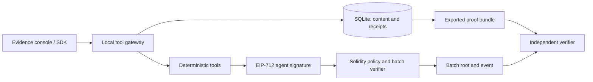

# Prooflane

**Portable, policy-bound execution receipts for agent tools.**

[](https://github.com/mitraboga/Prooflane/actions/workflows/ci.yml)

An agent calls tools on behalf of an owner. How can another party check which key authorized each recorded action, which policy the contract accepted it under, and whether its reported output changed later?

Prooflane answers that with an on-chain mandate, signed receipts, Merkle batch anchors, and an independent verifier. The demo runs end to end on your computer with no API key, wallet extension, faucet, token or payment required.

> **Status:** local portfolio prototype. Real Solidity execution on a local EVM; deterministic local tools; no public deployment, autonomous LLM, x402 payments or production security claim. A receipt verifies an authorized claim, not the truth of an AI answer.

## Run it

Requires **Node.js 24+** and npm on Windows x64, Linux x64/ARM64, or macOS x64/ARM64. The pinned native Anvil binary installs from npm automatically; optional dependencies must remain enabled. From this repository:

```sh
npm ci
npm start
```

Open **http://127.0.0.1:3000**. Startup compiles and deploys the contract once, starts the development chain, and serves the interface. On later starts it reuses the local chain and SQLite data. Both services bind to loopback only. Ports 3000 and 8545 must be available.

In a second terminal:

```sh
npm run demo
```

The SDK demo creates a mandate, executes two allowed tools, rejects a disallowed tool, anchors the batch, verifies a proof, and rejects a modified copy. It saves evidence at `data/exports/demo-receipt.json`.

## Try the visual demonstration

1. Choose **Create demo mandate**. It allows fingerprint and redaction tools with a 160-credit budget.
2. Execute **Document fingerprint**, then **Redact contact details**. Both receipts are signed and their credits reserved.
3. Attempt **Extract key sentences**. The mandate's allowlist rejects it before execution.
4. Select **Anchor pending receipts**. The contract checks each signature, tool proof, nonce, cap, budget and expiry atomically.
5. Select an anchored receipt and **Open in verifier**. The report checks content, signature, policy, inclusion and transaction provenance.
6. Select **Tamper with output**. The copy fails verification; the stored original remains available.

Use a custom mandate to demonstrate budget exhaustion or a per-call denial. Owner revocation blocks new execution and pending settlement while preserving already anchored evidence.

## What is implemented

- Responsive evidence console with mandate creation, tool execution, receipt inspection, export, verification and tamper demonstration.
- Node HTTP API, SQLite WAL persistence, serialized budget reservations, request idempotency and event replay after restart.
- Solidity mandates with immutable scope, agent identity, expiry, total/per-call limits and owner-only revocation.
- Domain-bound EIP-712 signatures and exact consecutive nonces; permissionless relaying without permission to forge claims.
- Sorted-pair Merkle allowlists and receipt proofs; batches of up to 32 linked to the previous accepted root.
- SHA-256 content commitments over a precisely defined canonical JSON encoding.
- Portable JSON evidence, standalone offline/online verifier, and a small JavaScript SDK.
- Adversarial contract, protocol and HTTP integration tests, including a mined-transaction recovery test.
- Reproducible gas/proof/verification benchmarks and a separate educational Bitcoin lab.

The tools really operate on the supplied text, but are deliberately deterministic: `document.digest` computes a fingerprint and statistics (20 credits); `text.redact` replaces common contact patterns (30); `text.summarize` extracts the first three sentences (40). No model service is involved, and redaction is not a comprehensive privacy filter.

## Architecture



The database serves queries and stores full content. The chain enforces acceptance rules and publishes commitments. A single trusted organization may be better served by signed logs or a transparency log. The blockchain is useful when counterparties need independently observable policy acceptance; it is not a replacement for ordinary storage.

Read [architecture and trust model](docs/architecture.md), [protocol specification](docs/protocol.md), and [research and precedents](docs/research.md).

## Verify outside the application

```sh
npm run verify -- data/exports/demo-receipt.json
```

Offline validity means internal consistency only. It cannot authenticate the included policy or prove the supplied root was ever on a chain.

For chain checks, supply the RPC, chain ID and contract address **independently**. Copy the contract address printed by your trusted local startup, replacing `CONTRACT_ADDRESS` below:

```sh
npm run verify -- data/exports/demo-receipt.json --rpc http://127.0.0.1:8545 --chain-id 31337 --contract CONTRACT_ADDRESS
```

The verifier fails if the configured deployment, immutable policy, root, matching event, transaction or block do not agree. Exit code `0` means the requested checks passed; `1` means verification failed. Public-chain confirmations/finality policies are not implemented by the local demo.

## Quality and measurements

```sh
npm run check
npm run compile
npm test
npm run benchmark
npm run lab:bitcoin
npm audit
```

The verified local suite contains **43 passing tests**. A 32-receipt batch used **92.15% less gas per receipt** than a singleton in the measured synthetic workload. See [benchmarks](docs/benchmarks.md) for raw samples and limits; this is not a production throughput claim. The GitHub Actions workflow runs syntax, compilation, tests and a dependency audit on Node 24; its current status is linked above.

The Bitcoin lab demonstrates double SHA-256, linked blocks, a bounded hash puzzle, a Merkle tree and a simplified UTXO ledger that rejects double spending. It is not a Bitcoin client, wallet, Script engine or implementation of decentralized consensus.

## Repository guide

| Path | Purpose |
| --- | --- |
| `contracts/Prooflane.sol` | Mandates, signature verification, metering and roots |
| `src/protocol.mjs` | Shared cryptographic definitions and offline verifier |
| `src/service.mjs` | Application rules, reservations, settlement and reconciliation |
| `src/chain.mjs` | Local EVM lifecycle and deployment |
| `src/store.mjs` | SQLite schema and transactions |
| `web/dist/` | Buildless browser interface |
| `sdk/client.mjs`, `examples/agent.mjs` | Integration client and complete example |
| `scripts/verify.mjs` | Independent verification CLI |
| `test/` | Contract, cryptography, lab and HTTP integration tests |
| `docs/` | Design, syllabus coverage, security, API, measurements and interview guide |

## Syllabus and resume

This project emphasizes Units 2 and 4 of GITAM **CSEN4031 Block Chain Technology**, with tested educational Bitcoin exercises and explicit coverage limits for the other units. It does not implement every platform or consensus algorithm listed in the course.

- [Exact syllabus mapping](docs/syllabus-map.md)
- [Resume bullets and five-minute interview walkthrough](docs/interview-guide.md)
- [Roadmap toward a real agent integration and shared service](docs/roadmap.md)
- [Security boundaries and operating notes](SECURITY.md)
- [API reference](docs/api.md)

Present the implemented mechanisms and measured outcomes you can explain. There is no claim of universal novelty, customers, production scale or a guaranteed hiring outcome. Source citations and non-blockchain precedents are documented so the architectural choice can be challenged.

## Testnet and GitHub

The optional `npm run deploy:testnet` script accepts `RPC_URL` and `DEPLOYER_PRIVATE_KEY` from the process environment and permits only Ethereum Sepolia or Base Sepolia. It deploys the contract only; it does not migrate the local UI/gateway to that network. Nothing submits a public transaction during normal startup, tests or benchmarks. Never fund the publicly known local development accounts.

The repository is ready to publish with its README, license, lockfile, CI and documentation. For a new empty GitHub repository:

```sh
git remote add origin YOUR_REPOSITORY_URL
git push -u origin main
```

The repository is [mitraboga/Prooflane](https://github.com/mitraboga/Prooflane). The command above also works with a separate repository of your own. If starting from a ZIP rather than a Git checkout, initialize Git and commit the files first. `.gitignore` excludes local data, exports, installed dependencies and environment secrets; the dependency lockfile is committed.

## Operating notes

`PORT`, `CHAIN_PORT`, and `DATA_DIR` are optional environment variables. Defaults are `3000`, `8545`, and `./data`. A `.env` file is not read automatically: use your shell's environment or Node's explicit `--env-file` option. To start a separate clean demo, choose a new `DATA_DIR`; preserve the old directory if you need its receipts. Keep chain and database state together. Stop with Ctrl+C.

This prototype intentionally uses readable JavaScript modules and the standard Node HTTP server instead of several frameworks. Runtime schemas, bounded inputs, the database constraints, cross-language tests and documented state transitions carry the reliability requirements. A typed SDK, external signer and production gateway are possible next steps, not current claims.

MIT licensed.
